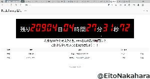

# Redefining Life
#### Video Demo: [https://www.youtube.com/watch?v=K6H94vAghpY](https://www.youtube.com/watch?v=K6H94vAghpY)
#### GIF Demo:

## Description (English
This project will be the final project of the CS50 course offered by Harvard University.

### Overview.
This project was created with the hope that people will be aware of the fact that life is finite and spend their lives in a meaningful way. The countdown on the top screen shows the time remaining from your registered birth date until you turn 80 years old, 80 years from now. We hope that you will be aware of the time you have left and use the to-do function to make plans for the future.

### Purpose of the project
The world is full of various entertainment activities, and if you are not conscious of time, time will pass in a flash.
* Do you know how much time you have left in your life?
* Are you aware that your life is finite?

Few people, including myself, are aware of the fact that life is finite. If you keep putting off what you really want to do or achieve, you may regret it. I wanted to create a web application that would help people be aware of the time remaining in their lives so that they can realize their dreams.

### Technologies used
Language: JavaScript, python

Framework: Flask

Database: MYSQL

### How to use
1. register as a user. (Register your user name, password, and date of birth) 2.
After logging in, the remaining time until you turn 80 years old will be displayed. 3.
3. press "Add" at the top of the screen and register when (by what age) and what you will do. 4.
4. After registering, the list of things you want to do will appear at the bottom of the screen. The number of days remaining for each thing you want to do will be displayed, so make sure you accomplish it before the number of days reaches zero.

## 説明(日本語)
本プロジェクトはハーバード大学が提供するCS50講座の最終課題制作物になります。

### 概要
本プロジェクトは、「人生が有限であることを意識して、有意義な人生を過ごして欲しい」という思いを込めながら制作を行いました。トップ画面にあるカウントダウンは登録した生年月日から80年後、80歳になるまでの残り時間を表示しています。自分の残された時間を意識しながら、ToDo機能を活用して今後の計画を立てていただければ幸いです。

### 制作目的
世にはさまざまな娯楽があふれており、時間を意識しなければあっという間に時間は過ぎてしまします。
* あなたは自分の人生の残り時間を知っていますか？
* 人生が有限であることを意識できていますか？

私を含め、常日頃から人生が有限であることを意識できている人は少ないでしょう。本当にやりたいこと、実現したいことをずっと後回しにしていると後悔することになるかも知れません。夢を実現するためにも人生の残り時間を意識できるWebアプリを作りたいと考え、制作しました。

### 使用技術
言語：JavaScript, python

フレームワーク：Flask

データベース：MYSQL

### 使い方
1. ユーザー登録を行います。（ユーザー名、パスワード、生年月日を登録）
2. ログインすると、あなたが80歳になるまでの残り時間が表示されます。
3. 画面上部の「追加」を押し、いつまでに(何歳までに)、何をやるのかを登録します。
4.登録後、画面下部にやりことリストとして表示されます。やりたいことごとに残りの日数が表示されるので、日数が0日になるまでに達成しましょう。

